# Calorie Counter

This is my final full stack project for Coder Academy. Before beginning this project most of my knowledge was in the backend technologies mainly using RESTful api's. Since starting this project I have learnt a considerable amount about how the front end technology works spending most of my time using Jinja2 and Bootstrap. This project is still a work in progress but it is deployed. It is deployed on AWS where I used an EC2 ran by NGINX and an RDS powered by postgreSQL. At the moment I have used the t2.micro for both the EC2 and RDS. It is noticable. The RDS is connected to the EC2 via a database URI which I hope to change to a private IP before assessment is marked for functionality purposes. I hope to continue to work and learn on this project hopefully setting up a CI/CD pipeline next. I unfortunately ran out of time. The Website is temporary for marking and if not avaiable I can deploy upon request to seek employment. 

The program has extra features to people who log in. If a user logs in they can store all the calories for the day onto the database. That database will continue to grow which I will hopefully set up graphs and stats for the user too see over time.

To test the user log in features enter the usernames below:

| Username | Password |
|---|---|
| user1 | 123 |
| user2 | 123 |

### Links to the website and github( The link was active during assessment. I can deploy if requested ):

Please take note that I changed the Website URL to an elastic IP. The one below URL is correct but the ones displayed in the images below are not correct.

||||
|---|---|---|
| R11 | Website URL: | http://54.153.218.136:5000/home/ |
| R12 | Github: | https://github.com/ScottBurleighHeads/ScottMalone_T4A2-B |

### R2)	Employ and utilise proper source control methodology (git)

Refer to https://github.com/ScottBurleighHeads/ScottMalone_T4A2-B to check commits.

### R3)	Use a recognised project management methodology

Agile methology was used for example I had a plan for the layout for recipes and after experiencing the webpage as a user i made an alteration for functionally and better user experience which can be seen in the difference in the wire frames with recipes and production.

Following the user stories I was capable of building a website through the eyes of the user. I wanted the user to have an easy way to record calories which I achieved with a push button. I wanted the user to be able to find recipes low in calories which I achieved by implementing a range input. I wanted the users to have access to nutrients, protein, fat and carbs which I achieved in the search results. I wanted better user experience which I achieved with result images, simple navigation and easy to understand search queries.  

### R4	Use a recognised task delegation methodology

Trello was used to record requirements and tasks.

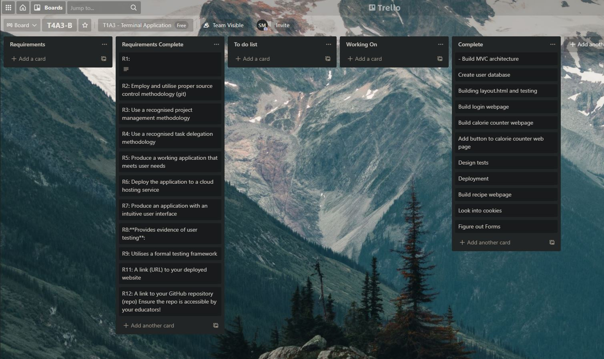

### R5	Produce a working application that meets user needs

Refer to http://13.211.200.115:5000/home/

### R6	Deploy the application to a cloud hosting service

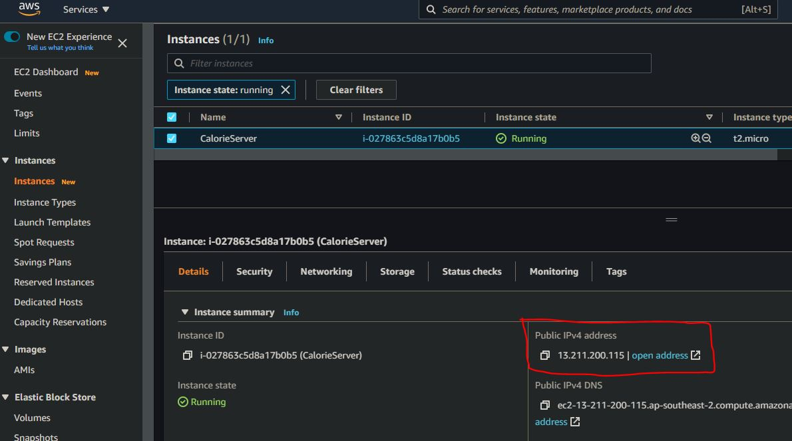
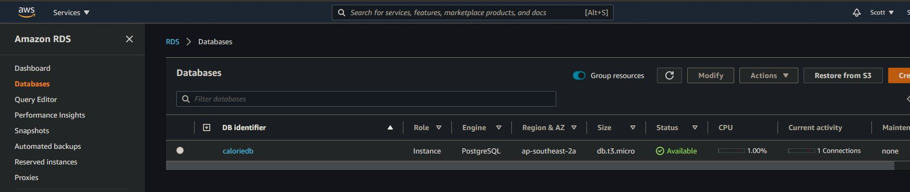

### R7 Produce an application with an intuitive user interface

Refer to http://13.211.200.115:5000/home/

Check images in R8

### R8 **Provides evidence of user testing**:

##### In the development environment

User not logged in for Calorie Counter web page and Recipe web page:

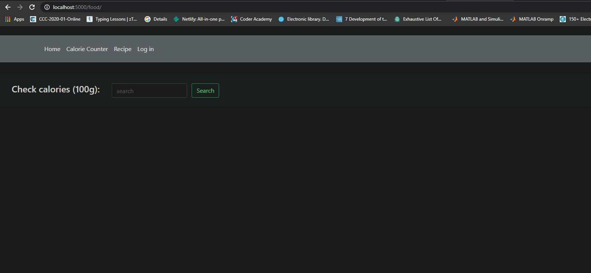
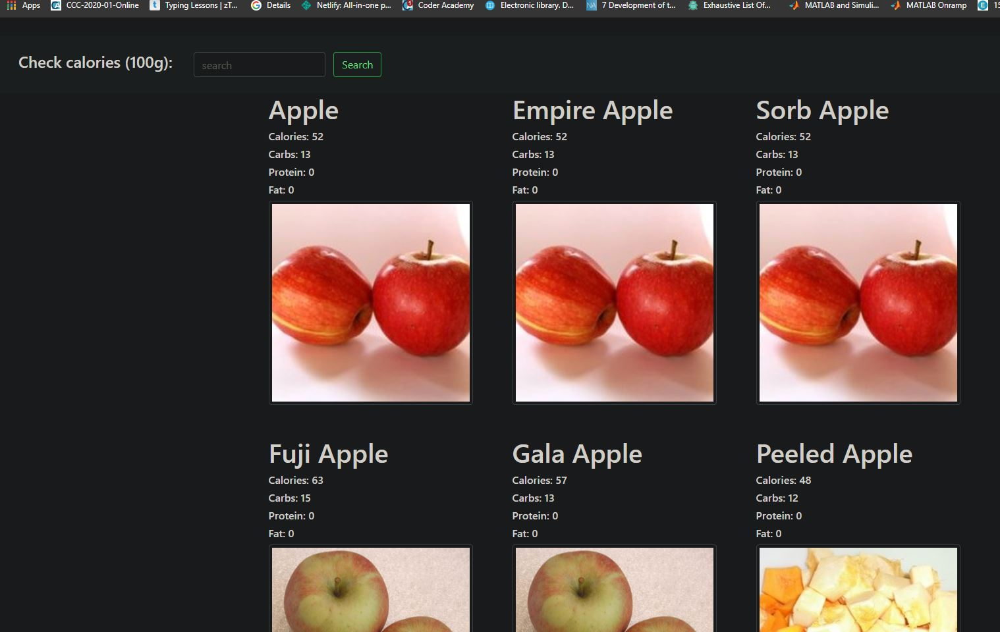
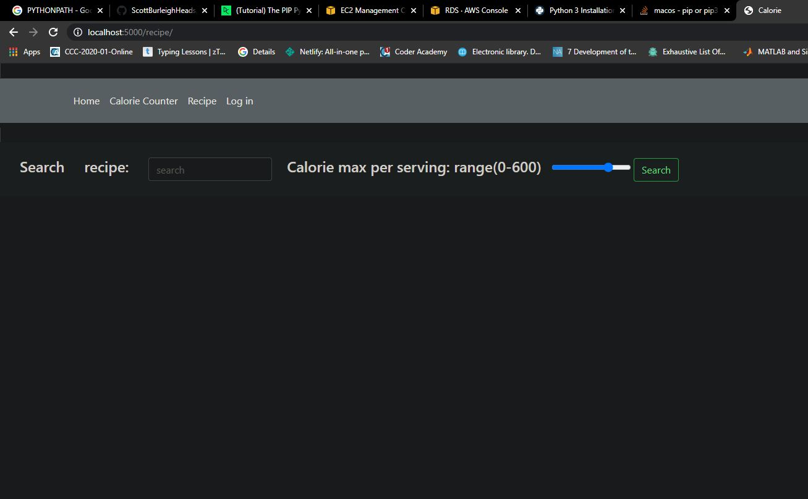
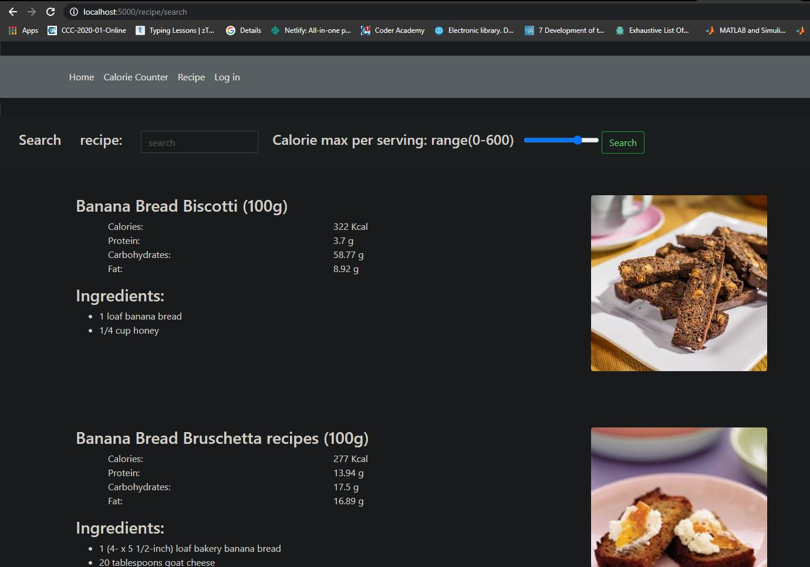

### User Logged in:

Take notice of calories recorded:

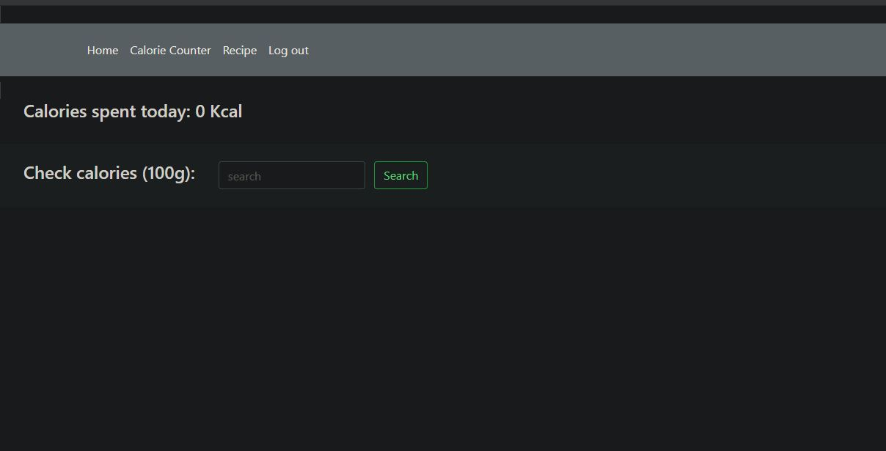

Take notice of the add feature:

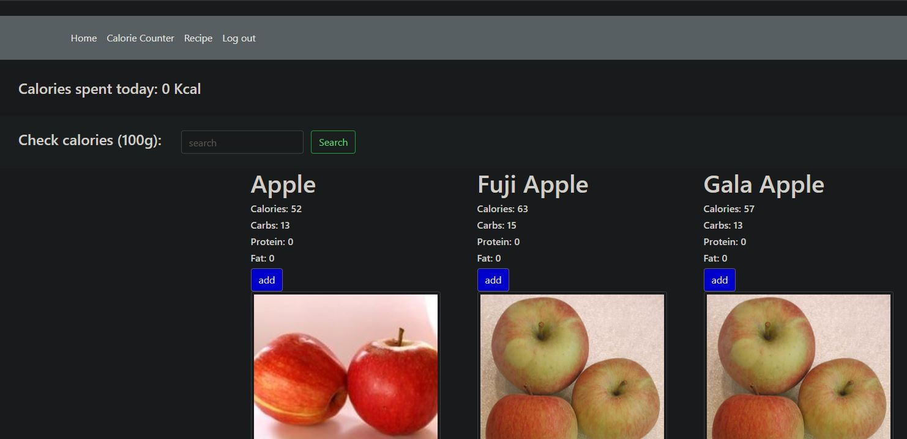

Take notice of the calories count for the day after apple was added:

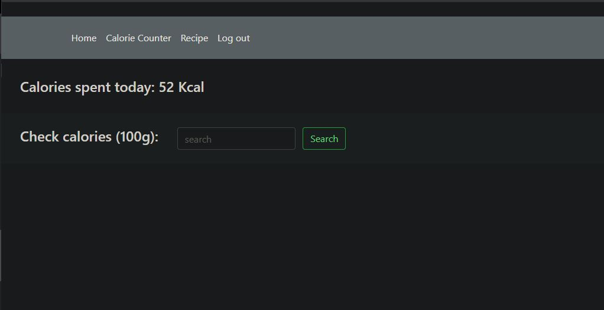

##### In production environment

Have a look at the IP addess and results for apple:

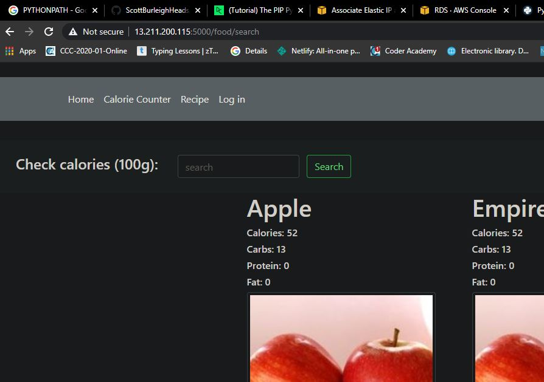

### R9: Utilises a formal testing framework

Unittest package was used:

Refer to /scottmalone_T4A2-B/backend_tests

Need to change flasks environment variable to testing in the terminal. Example below:

Run:
- export FLASK_ENV=testing
- python -m unittest discover -s backend_tests -v

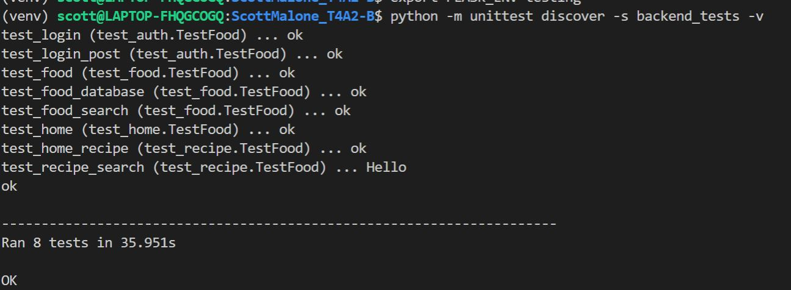

### R13: The contents of your README.md as submitted for Real World App - Part A (copy and paste)

### Description of your website, including:

- Purpose
- Functionality / features
- Target audience
- Tech stack

#### Purpose: 

##### Primary Purpose:

The primary purpose of this application is to monitor the calorie intake of food when consuming. When monitoring the intake of calories a person can manage there health a bit more consistantly. This application can assist in weight gain or weight loss. The applications main function is too to allow a user to input a keyword into a search engine then the result will return the calories of the food item. This application will record that items data and calculate a summation of the days calorie intake. It will further notify the user when they are close to their quota.

##### Functionality / features:

Considering the level of competition in the industry already the functionality is key to the success of the product. The program needs to be as simple as possible. The user will enter a sentence into a search field where a result will be displayed. The aim is to have more then one result then the user will select the closest option to their scenario.

Another added feature that will be attempted to implement is also to send recipe's of food that can be cooked that can keep the user under the quota, for example, if the user's calorie intake is 2800 calories and their currently sitting on 2200 calories the applications search engine can find a recipe for a meal that can be cooked that can keep them under the quota for the day which in this example would be less then 600 calories. Also there will be other data given such as fat, carbs and protein in the particular food item. This is useful for body builders that may want to increase their protein input. In fact it could be possible to monitor a large proportion of nutrients and insure that the user is receiving there recommended daily intake.

possible optional features are the user to take measurements and record the measurements into the application where the data can be analysed and displayed in graphs to show progress. This will be optional. Recordings can be pinch tests, weight on scales and tape measurements. Also recordings of physical activities.

##### Target Audience:

The most obvious are tech students that have been studying for 40 weeks and let themselves go. The general target audience will be adults who either want to reduce their calorie intake to lose weight or adults that might want to put weight on. Someone who wants to lose weight could set the quota to 2500 calories for the day yet a body builder might want to set the quota to 3500 calories. So all general adults who want to lose weight, adults that want to grow muscle and atheletes. It could be used by all people who want to keep a healthy well balanced diet.

##### Tech stack:

| Server-side ||
|---|---|
| Web Framework | Flask |
| Programming language | Python |
| Database engine | PostreSQL |
| Database storage | AWS S3 bucket |
| Web Server | AWS EC2 |
| Operating system | Ubuntu:latest |

| Client-side ||
|---|---|
| Web page language | HTML |
| Formating | CSS |
| Templating language | Jinja2/Bootstrap |

### Dataflow diagram

### Application Architecture

### User Stories

Following the Agile methology, user stories are used to guide the projects progress. The user stories give just enough information to give the project direction. A user story describes the target audience, the what and the why. Often companies can get bogged down on static production. Using Agile methodology and user stories gives flexibility and dynamic creation as the project transforms.

- **As a** user **I want to** count my calories **So I can** manage my health more consistently
- **As a** user **I want to** record my results **So I can** stay motivated to eat healthy
- **As a** user **I want to** find recipes that are filling and low in calories **So I can** lose weight
- **As a** user **I want to** find recipes high in protein **So I can** gain muscle
- **As a** user **I want to** save time researching healthy living **So I can** spend more time enjoying living 
- **Given** other users have succeeded **When** using the calorie counter **Then** I can succeed
- **Given** I still have calories spare **When** this day ends. **Then** I might splurge on a treat 
- **As a** developer **I want to** auto scale my website **So I can** reach more people when necessary
- **As a** developer **I want to** set up CI/CD pipeline **So I can** update any bugs when necessary
- **As a** developer **I want to** deploy the website on the cloud **So I can** save money on hardware

### Wireframes for multiple standard screen sizes, created using industry standard software

All wireframes were designed using Mockflow. Mockflow is a UX/UI designer application that has the ability to design Wireframes. Across many websites such as capterra.com have given the software a review of 4/5 stars on average yet sample sizes are small. I will assume that this software is great considering it has a free component and what you can achieve with the free component as given in the examples below. I assume that this is industry standards. Considering I am both the developer an user of this software. I will be taking in the Agile methodology of aim for an end goal and make alterations as the project progress's.

##### Mobile WireFrames:

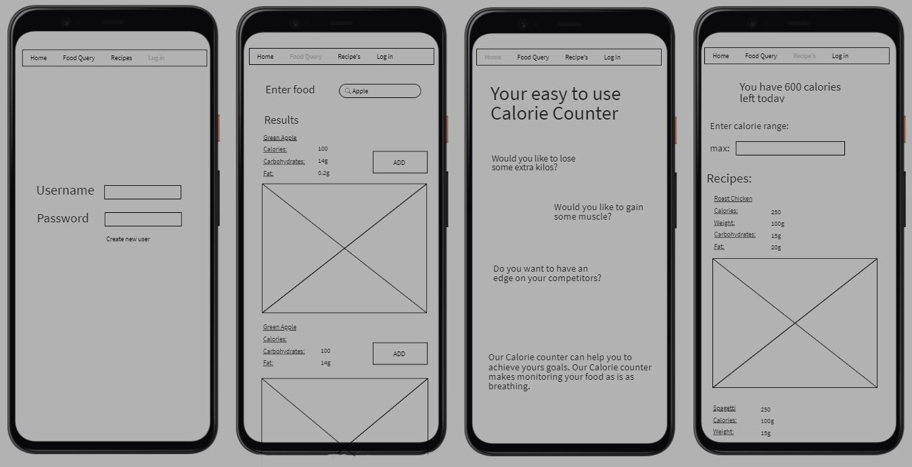

##### Desktop View

##### Home Page:

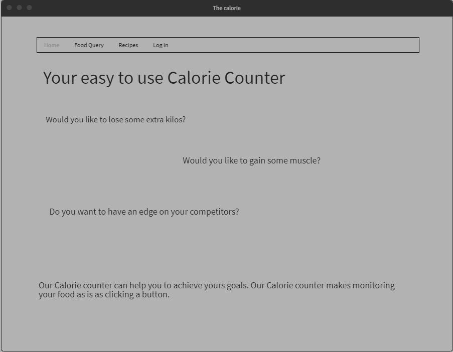

##### Log in:

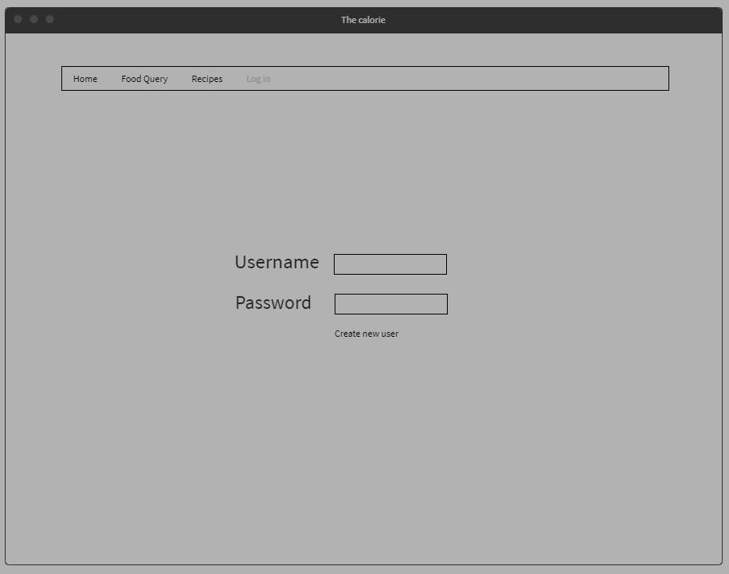

##### Recipes:

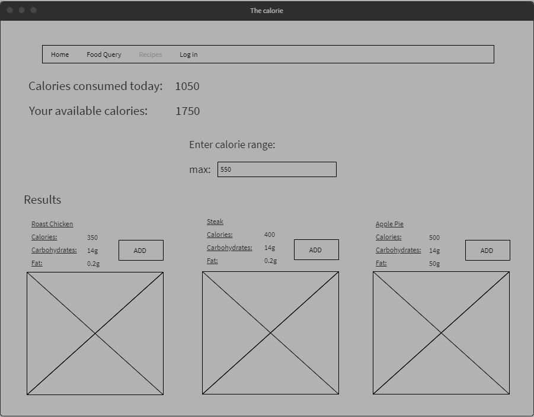

##### Food query:

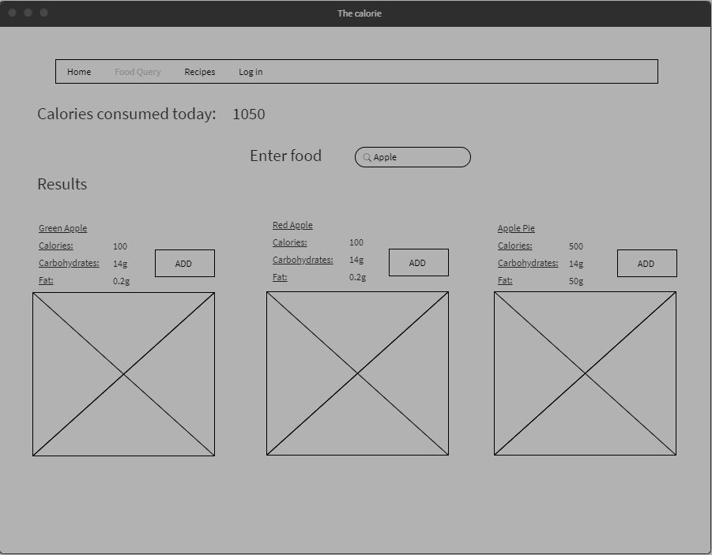

### R6: Screenshots of your Trello board throughout the duration of the project

Ideally the agile methology would be considered when working in teams. As new ideas arise they can be placed into the to-do list as seen in the below images. Their would be a team collaboration before placing it in the to do list. Considering no code has been written yet there has not been any changes added. When the new trello board is created for part-b I will be adding an optional think tank box or ideas box to bring up with the users to ask for feed back. Then may make changes.

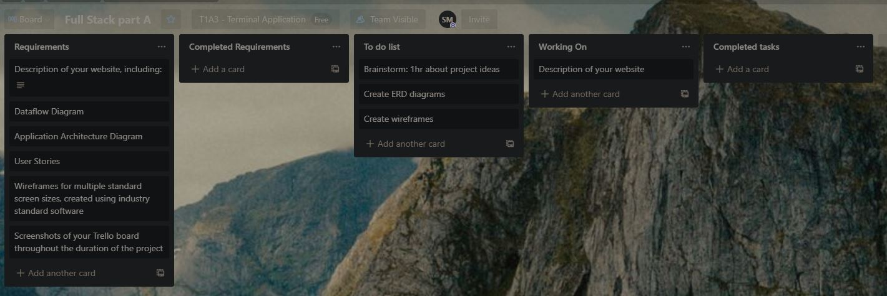
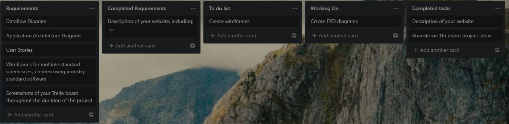
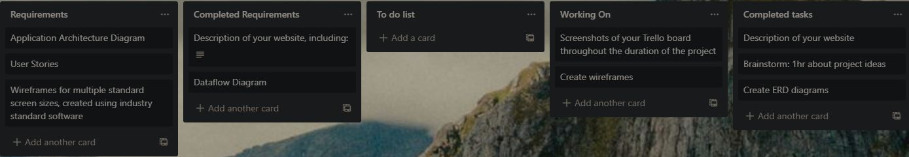

